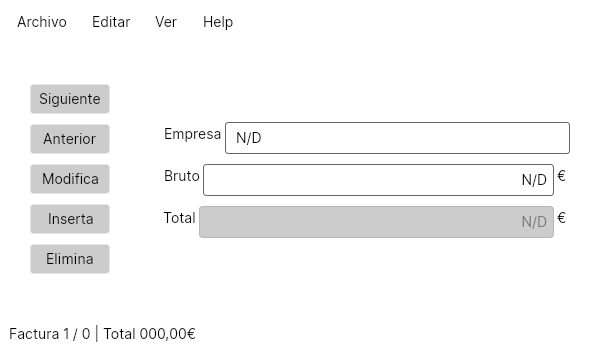

# Facturas

Una app C#/Avalonia con un CRUD de facturas, mostrando los siguientes aspectos:

- XAML para creación de vistas.
- StackPanel y DockPanel como organizaciones de controles.
- Botones, etiquetas y cajas de textos.
- Eventos.
- Utilización de diálogos.

## Captura de pantalla

## Instalación

Desde línea de comando, se puede arrancar con:

  $ dotnet run

Aunque también se incluye un projecto para Rider, y se puede abrir con Visual Studio.
